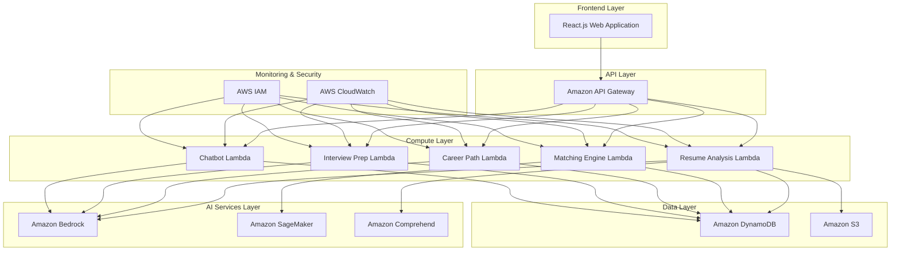

# Design Document: SkillBridge AI

## Overview

SkillBridge AI is a comprehensive serverless platform that leverages advanced AI services to revolutionize internship matching. The system combines natural language processing, machine learning recommendation algorithms, and conversational AI to create a holistic understanding of students and match them with optimal internship opportunities.

The platform addresses the fundamental limitations of keyword-based matching by implementing multi-dimensional analysis that considers skills, learning compatibility, success probability, and contextual factors. Built on AWS serverless architecture, the system provides scalable, cost-effective operations while maintaining high availability and performance.

## Architecture

### High-Level Architecture

The system follows a serverless microservices architecture pattern with clear separation of concerns:



### Architectural Principles

1. **Serverless-First**: All compute resources use AWS Lambda for automatic scaling and cost optimization
2. **Event-Driven**: Components communicate through events and API calls, enabling loose coupling
3. **AI-Native**: Core functionality built around AI services rather than traditional rule-based systems
4. **Data-Driven**: All recommendations and decisions backed by machine learning models and analytics
5. **Security by Design**: IAM roles, encryption, and privacy controls integrated throughout

## Components and Interfaces

### Frontend Application

**Technology**: React.js with TypeScript
**Responsibilities**:
- User interface for students and internship providers
- Resume upload and profile management
- Interview preparation interface
- Real-time chat with AI career advisor

**Key Interfaces**:
- Student dashboard with personalized recommendations
- Resume builder with AI-powered optimization
- Interactive career path exploration
- Mock interview simulator
- Provider dashboard for posting and reviewing candidates

### API Gateway Layer

**Service**: Amazon API Gateway
**Configuration**: REST API with resource-based routing
**Responsibilities**:
- Request routing to appropriate Lambda functions
- Authentication and authorization enforcement
- Rate limiting and throttling
- Request/response transformation

**Endpoints**:
- `/students` - Student profile management
- `/resumes` - Resume upload and analysis
- `/internships` - Internship posting and matching
- `/interviews` - Interview preparation services
- `/chat` - Career chatbot interactions

### Resume Analysis Service

**Implementation**: AWS Lambda with Amazon Bedrock and Comprehend
**Responsibilities**:
- Extract skills and experiences from uploaded resumes
- Generate comprehensive skill profiles
- Identify skill gaps and improvement areas
- Optimize resumes for specific roles

**AI Integration**:
- Amazon Comprehend for entity extraction and skill identification
- Amazon Bedrock (Claude 3) for content analysis and resume optimization
- Custom skill taxonomy for standardized skill classification

**Data Flow**:
1. Resume uploaded to S3 bucket
2. Lambda triggered by S3 event
3. Comprehend extracts entities and key phrases
4. Bedrock analyzes content for skills and experiences
5. Skill profile stored in DynamoDB
6. Optimization suggestions generated and cached

### Matching Engine Service

**Implementation**: AWS Lambda with Amazon SageMaker
**Responsibilities**:
- Calculate compatibility scores between students and internships
- Rank internships by success probability
- Consider constraints like location and availability
- Provide explanation for recommendations

**Machine Learning Approach**:
- Hybrid recommendation system combining collaborative and content-based filtering
- Deep learning model for complex relationship identification
- Feature engineering including skill vectors, academic background, and preferences
- Real-time inference using SageMaker endpoints

**Algorithm Components**:
1. **Content-Based Filtering**: Match based on skill similarity and role requirements
2. **Collaborative Filtering**: Leverage patterns from similar student profiles
3. **Success Prediction Model**: Predict completion probability using historical data
4. **Constraint Satisfaction**: Apply location, duration, and availability filters

### Career Path Discovery Service

**Implementation**: AWS Lambda with Amazon Bedrock
**Responsibilities**:
- Analyze student profiles for career path recommendations
- Suggest non-obvious career opportunities
- Generate personalized learning roadmaps
- Provide market insights and growth projections

**AI Integration**:
- Amazon Bedrock for career path analysis and roadmap generation
- Integration with labor market data for demand forecasting
- Personalization based on student interests and aptitudes

### Interview Preparation Service

**Implementation**: AWS Lambda with Amazon Bedrock
**Responsibilities**:
- Generate role-specific interview questions
- Conduct mock interviews with AI feedback
- Provide improvement suggestions and coaching
- Adapt difficulty based on performance

**Features**:
- Natural language processing for response analysis
- Sentiment analysis for confidence assessment
- Company-specific interview preparation
- Progress tracking and skill development

### Career Chatbot Service

**Implementation**: AWS Lambda with Amazon Bedrock
**Responsibilities**:
- 24/7 career guidance and support
- Answer questions about eligibility and requirements
- Guide through application processes
- Maintain conversation context

**AI Integration**:
- Amazon Bedrock for conversational AI capabilities
- Integration with knowledge base for accurate information
- Context management for multi-turn conversations
- Escalation to human advisors when needed

## Data Models

### Student Profile

```typescript
interface StudentProfile {
  studentId: string;
  personalInfo: {
    name: string;
    email: string;
    phone?: string;
    location: Location;
  };
  academicBackground: {
    institution: string;
    degree: string;
    major: string;
    gpa?: number;
    graduationDate: Date;
  };
  skillProfile: {
    technicalSkills: Skill[];
    softSkills: Skill[];
    skillGaps: string[];
    lastUpdated: Date;
  };
  preferences: {
    industries: string[];
    locations: Location[];
    duration: DurationPreference;
    workType: WorkType;
  };
  careerGoals: {
    shortTerm: string;
    longTerm: string;
    interests: string[];
  };
  documents: {
    resumeUrl: string;
    portfolioUrl?: string;
    transcriptUrl?: string;
  };
  activityHistory: ActivityRecord[];
  createdAt: Date;
  updatedAt: Date;
}

interface Skill {
  name: string;
  category: SkillCategory;
  proficiencyLevel: ProficiencyLevel;
  source: SkillSource;
  confidence: number;
}
```

### Internship Posting

```typescript
interface InternshipPosting {
  internshipId: string;
  providerId: string;
  basicInfo: {
    title: string;
    company: string;
    description: string;
    location: Location;
    duration: Duration;
    startDate: Date;
    applicationDeadline: Date;
  };
  requirements: {
    requiredSkills: SkillRequirement[];
    preferredSkills: SkillRequirement[];
    academicRequirements: AcademicRequirement;
    experienceLevel: ExperienceLevel;
  };
  programDetails: {
    learningObjectives: string[];
    mentorshipAvailable: boolean;
    projectDescription: string;
    teamSize: number;
  };
  compensation: {
    type: CompensationType;
    amount?: number;
    benefits: string[];
  };
  applicationProcess: {
    steps: ApplicationStep[];
    interviewRequired: boolean;
    portfolioRequired: boolean;
  };
  status: PostingStatus;
  createdAt: Date;
  updatedAt: Date;
}
```

### Matching Result

```typescript
interface MatchingResult {
  matchId: string;
  studentId: string;
  internshipId: string;
  scores: {
    overallCompatibility: number;
    skillMatch: number;
    learningCompatibility: number;
    successProbability: number;
    constraintSatisfaction: number;
  };
  explanation: {
    strengths: string[];
    concerns: string[];
    recommendations: string[];
  };
  ranking: number;
  calculatedAt: Date;
}
```

### Interview Session

```typescript
interface InterviewSession {
  sessionId: string;
  studentId: string;
  internshipId?: string;
  sessionType: InterviewType;
  questions: InterviewQuestion[];
  responses: InterviewResponse[];
  feedback: {
    overallScore: number;
    strengths: string[];
    improvementAreas: string[];
    specificFeedback: QuestionFeedback[];
  };
  duration: number;
  completedAt: Date;
}
```

### Chat Conversation

```typescript
interface ChatConversation {
  conversationId: string;
  studentId: string;
  messages: ChatMessage[];
  context: ConversationContext;
  status: ConversationStatus;
  createdAt: Date;
  lastMessageAt: Date;
}

interface ChatMessage {
  messageId: string;
  sender: MessageSender;
  content: string;
  timestamp: Date;
  metadata?: MessageMetadata;
}
```

## Correctness Properties

The following properties define the correctness requirements for SkillBridge AI and will be validated through property-based testing:

### Property 1: Resume Analysis Consistency
**Validates: Requirements 1.1, 1.2, 1.3**
For any valid resume upload, the AI_Resume_Analyzer must consistently extract skills and generate a comprehensive Skill_Profile with all required fields (technicalSkills, softSkills, skillGaps, lastUpdated) populated with valid data types and confidence scores between 0 and 1.

### Property 2: Resume Optimization Integrity
**Validates: Requirements 2.1, 2.3, 2.5**
For any resume optimization request, the system must maintain factual accuracy (no false information added), provide explanations for all changes made, and ensure the optimized resume contains only information derivable from the original resume and role requirements.

### Property 3: Career Path Completeness
**Validates: Requirements 3.1, 3.3, 3.5**
For any student profile analysis, the Career_Path_Engine must identify at least one suitable career trajectory, generate personalized learning roadmaps for each identified path, and include market demand data for all suggested career options.

### Property 4: Matching Engine Comprehensiveness
**Validates: Requirements 4.1, 4.2, 4.3, 4.4**
For any internship matching request, the Matching_Engine must consider all specified factors (skill similarity, learning compatibility, location, duration, availability), rank results by success probability, and provide detailed explanations for each recommendation.

### Property 5: Interview Feedback Consistency
**Validates: Requirements 5.2, 5.3, 5.4**
For any mock interview session, the Interview_Prep_System must provide real-time feedback, offer specific improvement suggestions upon completion, and adapt question difficulty based on measured performance metrics.

### Property 6: Chatbot Context Preservation
**Validates: Requirements 6.2, 6.4**
For any chatbot interaction, the Career_Chatbot must provide advice based on the student's current profile data and maintain conversation context across multiple message exchanges within the same session.

### Property 7: Profile Data Integrity
**Validates: Requirements 7.1, 7.2, 7.3**
For any profile operation, the system must collect all required fields during creation, track skill development changes over time with timestamps, and trigger recommendation recalculation when profile modifications occur.

### Property 8: Provider Interface Completeness
**Validates: Requirements 8.1, 8.2, 8.3, 8.5**
For any internship posting or candidate review, the system must collect all required role details, provide ranked candidate lists with success probability scores, include explanations for recommendations, and update availability status with student notifications.

### Property 9: Analytics Data Consistency
**Validates: Requirements 9.1, 9.2, 9.4**
For any completed internship, the system must collect feedback from both parties, measure all specified outcome metrics (completion rates, performance ratings, satisfaction scores), and generate comprehensive reports on platform effectiveness.

### Property 10: Security and Privacy Compliance
**Validates: Requirements 10.1, 10.3, 10.4**
For any data operation, the system must encrypt all personal information, only share data with explicit user consent, and implement secure authentication mechanisms that prevent unauthorized access.

## Testing Framework

**Property-Based Testing Library**: fast-check (JavaScript/TypeScript)
**Unit Testing Framework**: Jest
**Integration Testing**: AWS SDK mocks and LocalStack for AWS services
**End-to-End Testing**: Playwright for frontend workflows

### Testing Strategy

1. **Property Tests**: Validate universal properties across all input combinations
2. **Unit Tests**: Test specific examples and edge cases for individual components
3. **Integration Tests**: Verify AWS service interactions and data flow
4. **End-to-End Tests**: Validate complete user workflows from frontend to backend

### Test Data Generation

- **Smart Generators**: Constrain input space to realistic student profiles, resume formats, and internship postings
- **Edge Case Coverage**: Include boundary conditions, empty inputs, and malformed data
- **Realistic Scenarios**: Use representative data that mirrors actual platform usage patterns
```

Now I need to use the prework tool to analyze the acceptance criteria before writing the Correctness Properties section:

<function_calls>
<invoke name="prework">
<parameter name="featureName">skillbridge-ai